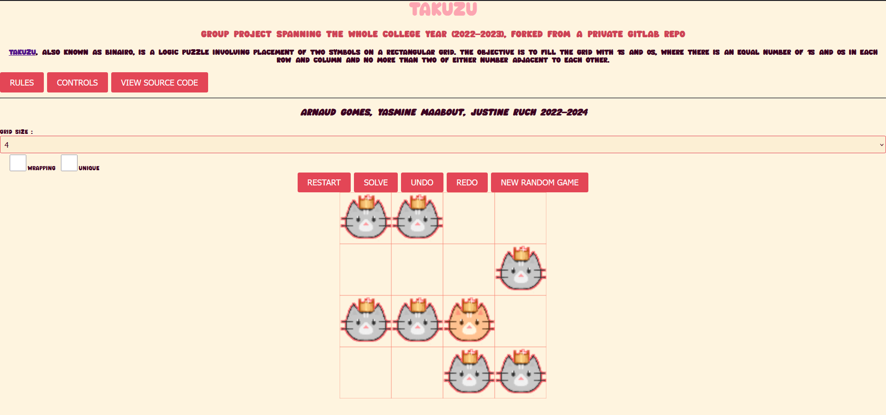

# 🐱 Takuzu Puzzle Game Recreation in C 🐱

## Web Version using Javascript + WASM

Group project spanning the whole college year (2022-2023), forked from a private gitlab repo (https://gitlab.emi.u-bordeaux.fr/pt2/backup/2022-2023/teams/tm11/takuzu-11c)

Hosted on Vercel, try it here: [Takuzu Game](https://takuzu-group-project.vercel.app/)

### Features

- 🧩 Game solver
- 🎲 Random game generator
- 📏 Customizable grid size and game options
- 📱 Support for mobile devices with responsive CSS and custom controls

Original README :

**#takuzu - 11c**

Projet réalisé par les étudiants :
Arnaud Gomes
Yasmine Maabout
Justine Ruch

**Le jeu takuzu**
On dispose d'une grille qu'il faut remplir de carrés noirs et blancs en respectent les règles suivantes :
-il ne peut pas y avoir plus de 2 carrés de meme couleur à la suite
-il ne doit pas y avoir plus de la moitié des cases d'une ligne ou d'une colonne de meme couleur
Il est possible de rajouter deux règles facultatives :
-il ne peut y avoir deux lignes ou colonnes identiques
-le jeu se replie sur lui-meme et ainsi les cases de deux extrémités se suivent

**game_text.c**
Permet de jouer avec le jeu et les règles par défaut en utilisant la commande ./game_text dans le terminal.
Les commandes s'affichent en appuyant sur h.
Pour jouer une pièce noir ou blanche ou vider une case il faut tapper dans le terminal la lettre correspondant (w,b,e) suivit des coordonées où l'on souhaite jouer, par exemple w 0 0.
Pour recommencer le jeu tapper r et pour le quitter q.
Pour undo et redo appuyer respectivement sur z et y.
Enfin pour sauvegarder il faut écrire s <filename> où filename est le nom souhaité pour le fichier qui sera sauvegarder au format filename.txt dans le dossier du jeu.

**game_solve.c**
Utilisation des fonctions nb_solutions et solve.
Permet de chercher la ou les solutions d'un jeu chargé.

**game_sdl.c**
Permet de jouer sur l'interface graphique du jeu en utilisant la commande ./game_sdl dans le terminal.
Pour charger un jeu il suffit d' écrire le nom du jeu à la suite de la commande, par exemple ./game_sdl 6x6_empty.txt ouvrira un jeu vide de 6 par 6.
Les commandes s'affichent en appuyant sur h sur la fenetre du jeu.
Pour jouer il faut cliquer dans une case. Si elle est vide la pièce joué est blanche. Si il y a une pièce blanche dans la case la pièce devient noir. Enfin si il y a une pièce noir un clic va vider la case.
Pour recommencer le jeu appuyer sur r et pour le quitter sur q.
Pour undo et redo appuyer respectivement sur z et y.
Pour chercher la solution du jeu appuyer sur s.
Enfin pour sauvegarder le jeu appuyer sur ctrl et s.

**game.c**
Implémentation des fonctions pour utiliser un jeu.

**game_aux.c**
Implémentation des fonctions d'affichage et de définition du jeu par défaut.

**game_ext.c**
Implémentation de la V2 avec les règles facultatives.
Ajout des fonction undo et redo.

**game_tool.c**
Implémentation des fonctions load et save qui permettent de charger et de sauvgarder un jeu.
Ainsi que les fonctions solve et nb_solutions qui cherche une solution et le nombre de solution d'un jeu donné.
